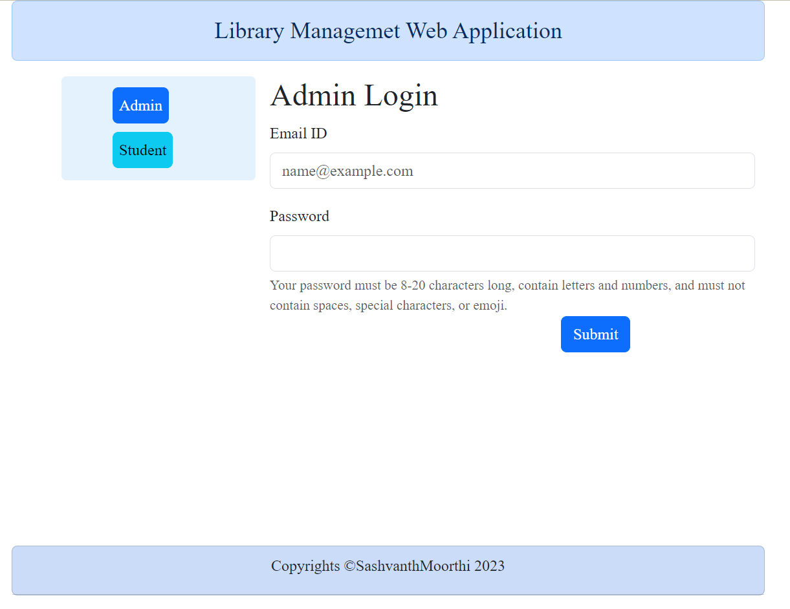
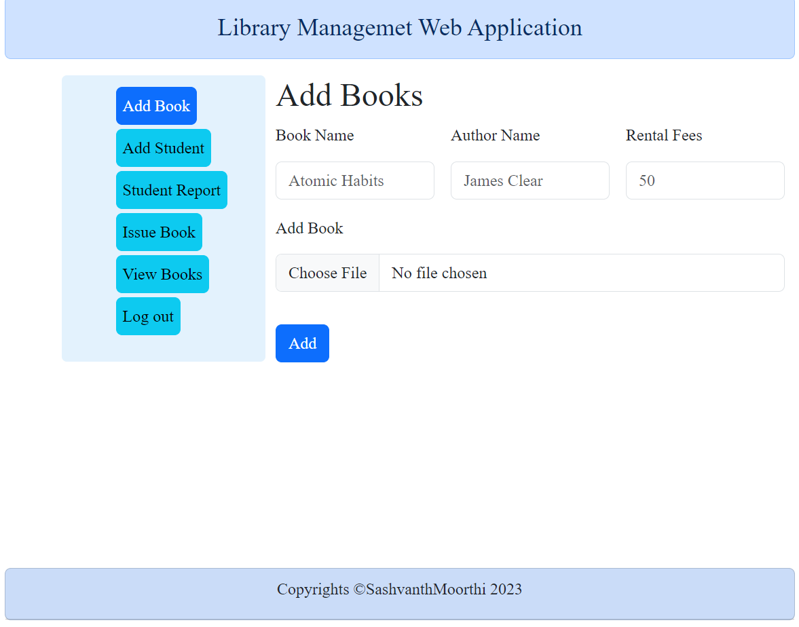
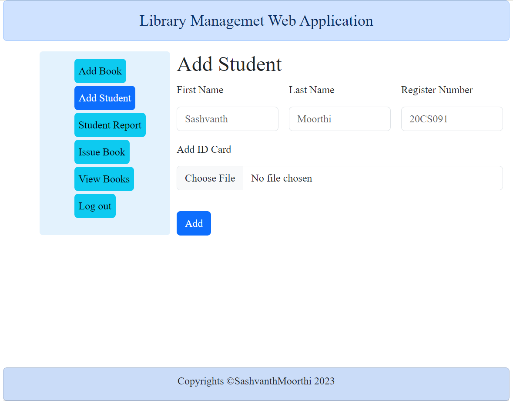
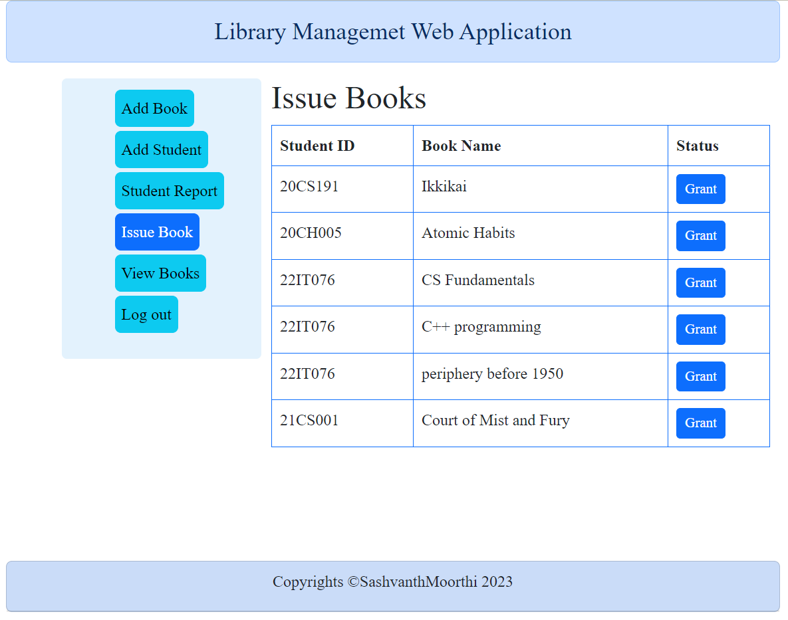
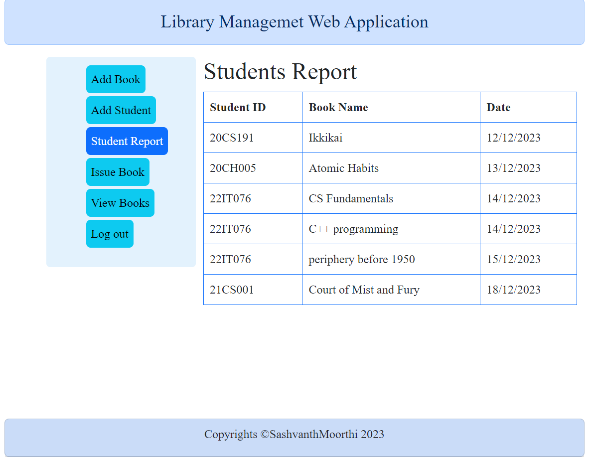
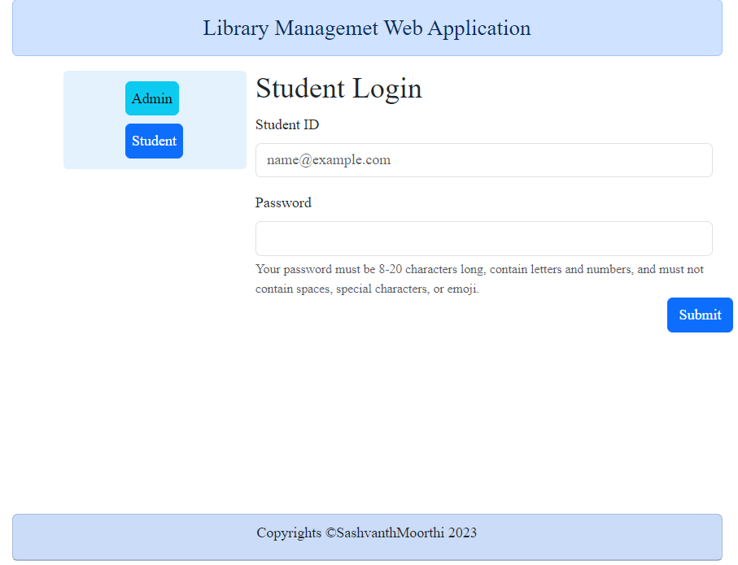
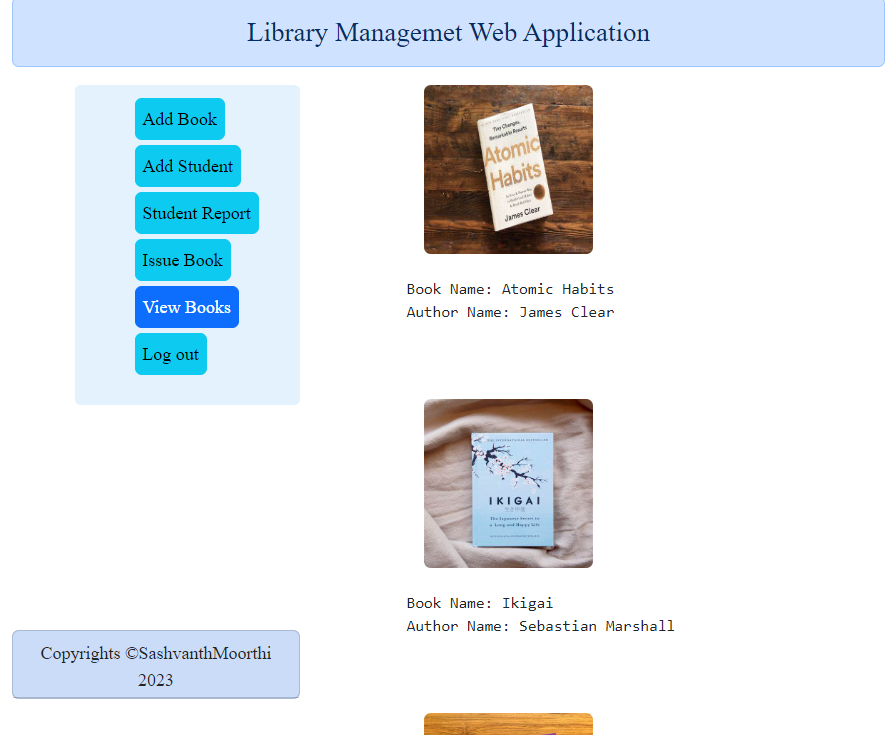
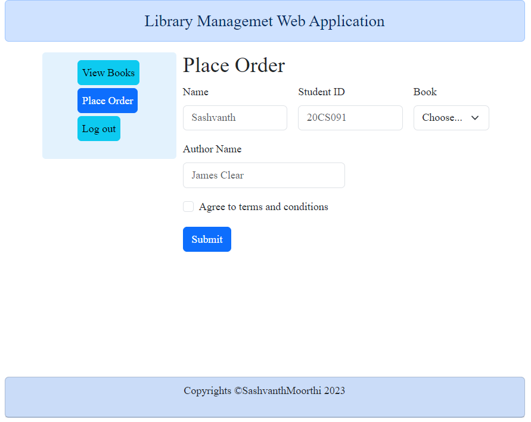

# Library Management System

> An automated system to manage a public library. Admin panel for librarians to control and manage the system easily through an interactive interface.

 + [Development](#development)
 + [Features](#features)

## Development
<h3 align="left">Languages and Tools:</h3>

 

           

Notes in mind, Windows setup is not too tricky:

* Open git shell;

* `git clone https://github.com/sashvanth0430/LibraryManagementSystem.git`;

* `cd LibraryManagementSystem`;

## Live Link
https://sashvanth0430.github.io/LibraryManagementSystem/

## Features
 + Librarians can be given their authorized login ID and password without which the system can not be accessed.
 + Students can only access limited features, i.e., public access level features which include **searching a book** and **student registration form**.
 + After logging in librarians can search for a specific book, book issue or student from the home panel.
 + Librarians need to make an entry for new books. To automate the process they simply need to enter the number of issues, then the Issue ID for each book issue is generated automatically.
 + Another responsibility of a librarian is to approve students in situations where approval is needed, i.e. where documents are to be verified or some manual work. Librarians have a panel to simply approve / reject students and to view all approved students. The librarian ID is stored alongside each approved/rejected student to keep track.
 + The most important function of any library is to issue and return books. This system includes a panel to view all outstanding logs and a super simple panel to issue and return books for all librarians.

## Screenshots
<h3> Admin Login Page</h3>

By using this page Admin can log on to the system

<h3> Add Book Page</h3>

By using this page Admin can add new book into system

<h3> Add Student Page</h3>

By using this page Admin can add students to the system

<h3> Issue Book Page</h3>

By using this page Admin can manage issuing books from library

<h3> Student Report Page</h3>

By using this page Admin can see students who take books from library

<h3> Student Login Page</h3>

By using this page Students can log in to the system

<h3> Books Page</h3>

By using this page Students can view the books available in library

<h3> Place Order Page</h3>

By using this page Students can place order

